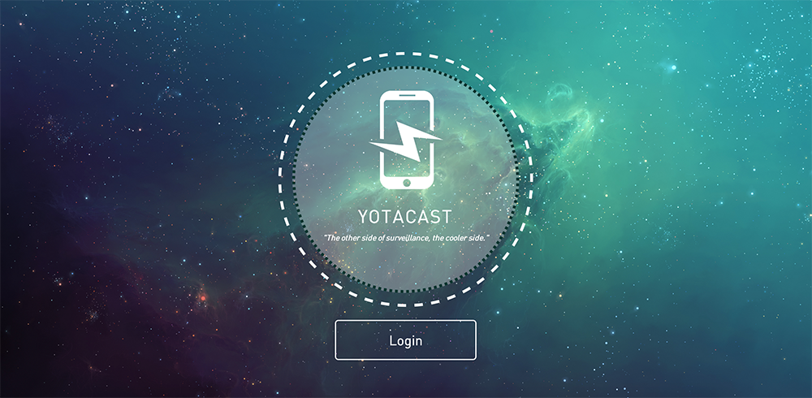
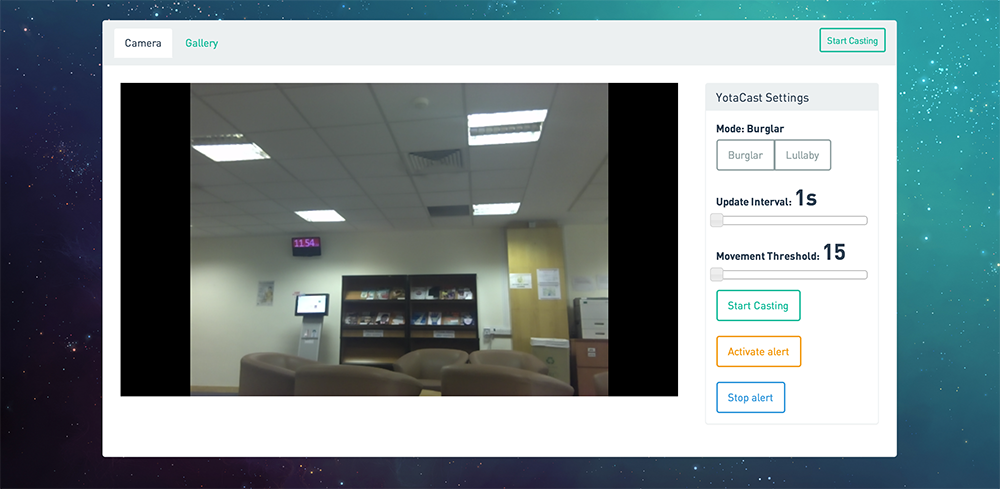
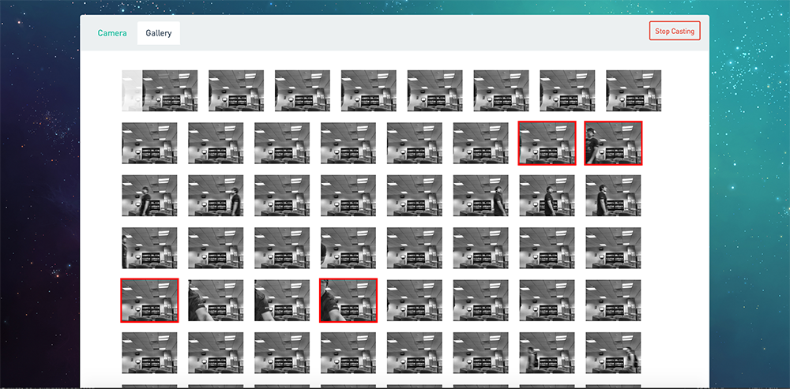
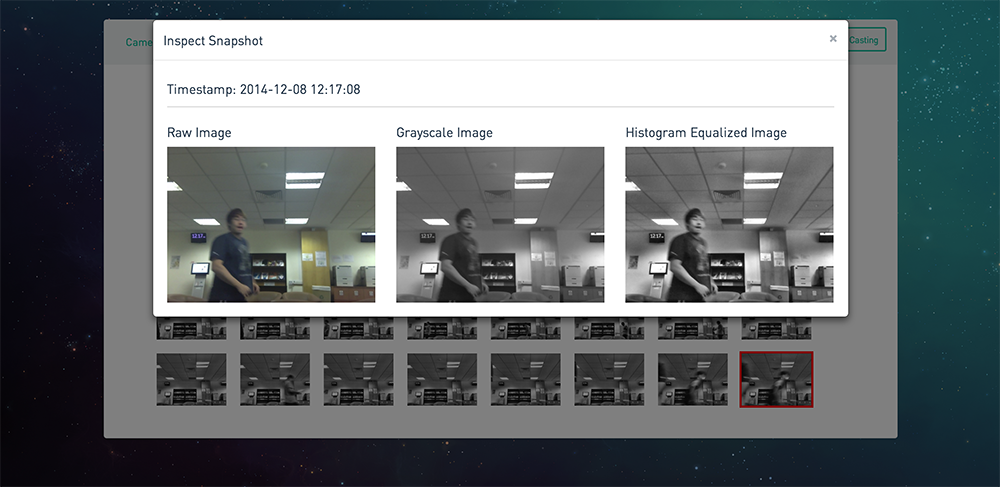

# YotaCast

This project was a submission to [Hackatron Asia 2014](http://hackatron.techinasia.com), which we subsequently won first place. Yotacast is now released open-source so that everyone can get a feel on how to make a YotaPhone app.

## Introduction
Yotacast is a home surveillance app made specificially for the [YotaPhone's](http://yotaphone.com/ru-en) e-ink display. While there are many surveillance apps are there in the market, those implementations require users to leave their screens turned on constantly in order to get the camera feeds. With YotaPhone, we can now display snapshots at preset time intervals on YotaPhone's e-ink display on the back. This means **constant access** to monitor your house, and at the same time conserving your phone's power consumption.

Using OpenCV, we added motion detection features to the cameras to notify your phone whenever your webcam detects movements at home. At the same time, we used local histogram equalization algorithms to enhance the grayscale image so that the images are displayed in greater detail in the e-ink display.

If motion is detected beyond the specified threshold, users will be alerted on their mobile phone and they can trigger an alarm that will be played on their computers.

## Screenshots

##### Landing Page

##### Dashboard
Users can start saving their camera snapshots to the web server.

##### Mobile
Users can view their snapshots on the phone as a widget. On YotaPhones, it will be shown on the e-ink display.

##### Gallery
Users can view the saved camera snapshots and inspect them.

Localized histogram equalization is carried out to enhance the quality of the image so that users can view more details.

## Team
- Tay Yang Shun [(https://github.com/yangshun)](https://github.com/yangshun)
- Chua Wei Kuan [(https://github.com/khankuan)](https://github.com/khankuan)
- Lim Keng Kiat [(https://github.com/crainiarc)](https://github.com/crainiarc)
- Chee Wai Hon [(https://github.com/imwaihon)](https://github.com/imwaihon)
